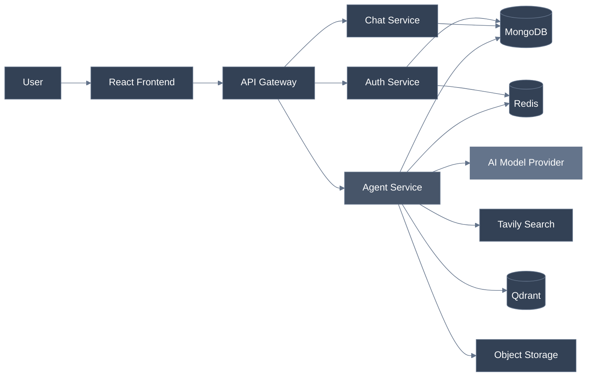
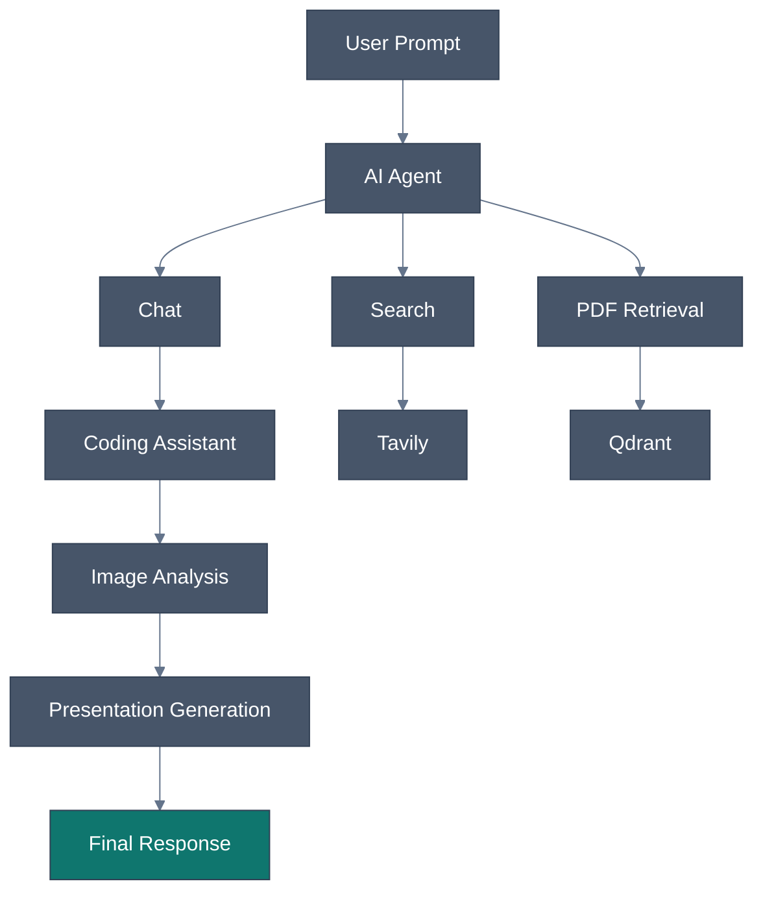
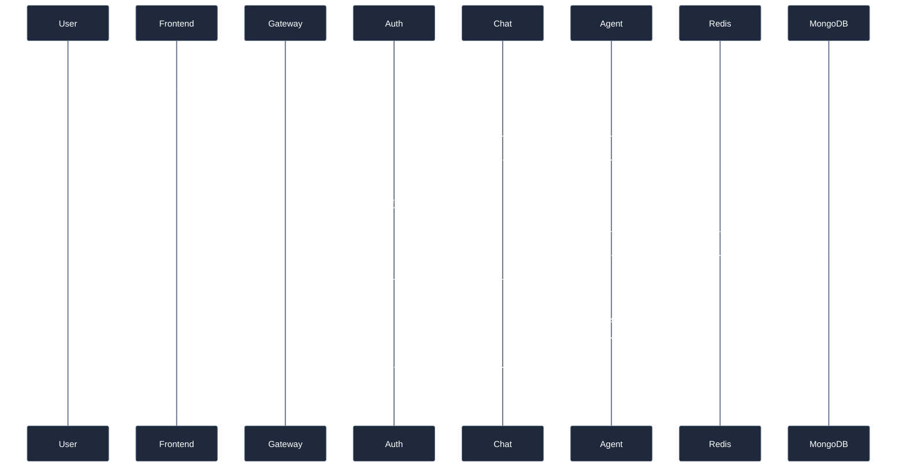
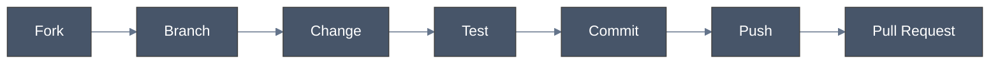

<div align="center">

# AI Assistant

**A full-stack, agentic AI platform for conversational intelligence, retrieval, and generation.**


<p>
  
  
  
  
  
  
  
</p>

<p>
  <a href="#quick-start"><b>Quick Start</b></a> ·
  <a href="#features"><b>Features</b></a> ·
  <a href="#architecture"><b>Architecture</b></a> ·
  <a href="#api-documentation"><b>API Reference</b></a> ·
  <a href="#roadmap"><b>Roadmap</b></a>
</p>

</div>

<br/>

## Overview

**AI Assistant** is an authenticated, full-stack conversational AI platform built on a modular microservices architecture. Authentication, conversation management, agent execution, and API routing are cleanly separated into independent backend services — each one scalable, testable, and swappable on its own.

| Capability | Description |
|---|---|
| **Chat** | Real-time, context-aware conversational interaction |
| **Web Search** | Grounded, search-augmented responses via Tavily |
| **Coding** | Code generation, debugging, and technical explanation |
| **PDF Retrieval** | Document ingestion with vector-based semantic search |
| **Vision** | Image upload and analysis via vision-capable models |
| **Slides** | Structured, AI-generated presentation artifacts |

<br/>

## Architecture



<details>
<summary><b>Expand full system diagram</b></summary>

```text
                              ┌───────────────────┐
                              │        User        │
                              └──────────┬──────────┘
                                         │
                                         ▼
                              ┌───────────────────┐
                              │  React + Vite UI   │
                              └──────────┬──────────┘
                                         │
                                         ▼
                              ┌───────────────────┐
                              │    API Gateway      │
                              │        :4000        │
                              └────────┬───┬────────┘
                                       │   │
                       ┌───────────────┘   └───────────────┐
                       ▼                                    ▼
              ┌─────────────────┐                  ┌─────────────────┐
              │  Auth Service    │                  │  Chat Service    │
              │      :4001       │                  │      :4002       │
              └────────┬─────────┘                  └────────┬─────────┘
                       │                                      │
                       └──────────────────┬───────────────────┘
                                          │
                                          ▼
                               ┌────────────────────┐
                               │   Agent Service      │
                               │   (LangGraph) :4003   │
                               └──────────┬────────────┘
                                          │
                ┌─────────────────────────┼─────────────────────────┐
                ▼                         ▼                         ▼
         AI Model Providers          Web Search               Document Store
       OpenAI · Gemini · Groq          (Tavily)                  (Qdrant)
       Mistral · OpenRouter
                │                         │                         │
                └─────────────────────────┼─────────────────────────┘
                                          ▼
                                  Object Storage (S3)
```

</details>

### Agent Execution Flow

Built on **LangGraph**, the agent is the platform's central intelligence layer — dynamically routing each request to the appropriate capability rather than treating every prompt as a flat chat completion.



<br/>

## Project Structure

```text
AI-Assistant/
│
├── Frontend/                  React 19 + Vite client
│
└── Backend/
    │
    ├── gateway/                Public API gateway
    │
    ├── services/
    │   ├── auth/                Authentication & user management
    │   ├── chat/                Conversations & message history
    │   └── Agent/                LangGraph-based AI agent
    │
    └── shared/                  Shared auth & Redis utilities
```

<br/>

## Features

<table>
<tr>
<td width="50%" valign="top">

**Conversational AI**
- Real-time, multi-turn interaction
- Persistent conversation history
- Pluggable model providers
- Context-aware agent reasoning

</td>
<td width="50%" valign="top">

**Web Search**
- AI-directed, search-grounded answers
- Tavily-powered retrieval
- Reduces hallucination on current events

</td>
</tr>
<tr>
<td width="50%" valign="top">

**Document Intelligence**
- PDF ingestion and chunking
- Vector embeddings via Qdrant
- Semantic retrieval over uploaded documents

</td>
<td width="50%" valign="top">

**Vision**
- Image upload and analysis
- Vision-capable model integration
- Natural-language image understanding

</td>
</tr>
<tr>
<td width="50%" valign="top">

**Coding Assistant**
- Code generation and refactoring
- Debugging support
- Plain-language technical explanations

</td>
<td width="50%" valign="top">

**Presentation Generation**
- Structured, AI-authored slide content
- Artifact creation
- S3-compatible storage for outputs

</td>
</tr>
</table>

<br/>

## Tech Stack

| Layer | Technologies |
|---|---|
| **Frontend** | React 19, Vite, JavaScript |
| **Backend** | Node.js, Express-style API Gateway, MongoDB, Redis, LangGraph |
| **AI Providers** | OpenAI, Google AI, Groq, Mistral, OpenRouter, Moonshot |
| **Integrations** | Tavily Search, Qdrant, S3-compatible storage, Firebase Admin |

<br/>

## Quick Start

### Prerequisites

| Requirement | Notes |
|---|---|
| Node.js 20+ | Required |
| npm | Required |
| MongoDB | Required |
| Redis | Required |
| Firebase Admin credentials | Required |
| At least one AI provider API key | Required |
| Tavily API key | Optional — enables web search |
| Qdrant | Optional — enables PDF retrieval |
| S3-compatible storage | Optional — enables artifact storage |

### Clone & Install

```powershell
git clone <your-repository-url>
cd AI-Assistant
```

<details>
<summary><b>Install every service</b></summary>

```powershell
# Frontend
cd Frontend
npm install

# Gateway
cd ..\Backend\gateway
npm install

# Auth Service
cd ..\services\auth
npm install

# Chat Service
cd ..\chat
npm install

# Agent Service
cd ..\Agent
npm install
```

</details>

<br/>

## Environment Variables

> **Never commit `.env` files or Firebase service-account credentials.**

Create a `.env` file inside each backend service.

<details>
<summary><b>Gateway — <code>Backend/gateway/.env</code></b></summary>

```env
PORT=4000
FRONTEND_URL=http://localhost:5173
AUTH=http://localhost:4001
CHAT=http://localhost:4002
AGENT=http://localhost:4003
```

</details>

<details>
<summary><b>Auth Service — <code>Backend/services/auth/.env</code></b></summary>

```env
PORT=4001
db=mongodb://127.0.0.1:27017/ai-assistant
REDIS_URL=redis://127.0.0.1:6379
```

Firebase Admin credentials live at `Backend/services/auth/config/services.json` — **never commit the real file.**

</details>

<details>
<summary><b>Chat Service — <code>Backend/services/chat/.env</code></b></summary>

```env
PORT=4002
db=mongodb://127.0.0.1:27017/ai-assistant
```

</details>

<details>
<summary><b>Agent Service — <code>Backend/services/Agent/.env</code></b></summary>

```env
PORT=4003
db=mongodb://127.0.0.1:27017/ai-assistant
REDIS_URL=redis://127.0.0.1:6379
CHAT_SERVICE=http://localhost:8002

# AI Model Providers
OPENAI_API_KEY=
GOOGLE_API_KEY=
GROQ_API_KEY=
MISTRAL_API_KEY=
OPENROUTER_API_KEY=
MOONSHOT_API_KEY=

# Optional integrations
TAVILY_API_KEY=
QDRANT_URL=
QDRANT_API_KEY=
AWS_REGIONS=
AWS_BUCKET=
accessKeyId=
secretAccessKey=
accountId=
```

Configure the active provider in `Backend/services/Agent/utils/model.js`.

</details>

<details>
<summary><b>Frontend — <code>Frontend/.env</code></b></summary>

```env
VITE_BACKEND_URI=http://localhost:8000/api
```

> Never put secret keys in `VITE_*` variables — Vite exposes these to the browser bundle.

</details>

<br/>

## Redis Setup

```powershell
cd Backend
docker compose up -d redis   # start
docker ps                    # verify
docker compose down          # stop
```

<br/>

## Running the Application

Run each service in its own terminal:

| Terminal | Service | Command |
|---|---|---|
| 1 | Auth | `cd Backend\services\auth && npm run dev` |
| 2 | Chat | `cd Backend\services\chat && npm run dev` |
| 3 | Agent | `cd Backend\services\Agent && npm run dev` |
| 4 | Gateway | `cd Backend\gateway && npm run dev` |
| 5 | Frontend | `cd Frontend && npm run dev` |

### Local URLs

| Service | URL |
|---|---|
| Frontend | `http://localhost:5173` |
| Gateway | `http://localhost:4000` |
| Auth | `http://localhost:4001` |
| Chat | `http://localhost:4002` |
| Agent | `http://localhost:4003` |

Gateway health check: `http://localhost:4000/`

<br/>

## API Documentation

All public requests are routed through the gateway under the `/api` prefix.

| Route | Method | Description |
|---|---:|---|
| `/api/auth/login` | `POST` | Create or authenticate a user |
| `/api/auth/logout` | `GET` | Log out the current user |
| `/api/auth/me` | `GET` | Get the authenticated user |
| `/api/chat/create-conversation` | `GET` | Create a conversation |
| `/api/chat/get-conversation` | `GET` | List conversations |
| `/api/chat/save` | `POST` | Save a message |
| `/api/chat/update` | `PUT` | Update a conversation |
| `/api/chat/message` | `GET` | Retrieve messages |
| `/api/agent/chat` | `POST` | Execute the AI agent |

**File uploads to the agent** use multipart form-data with a `file` field:

```text
POST /api/agent/chat
Content-Type: multipart/form-data
```

<br/>

## Request Lifecycle



<br/>

## Microservices

| Service | Responsibilities |
|---|---|
| **Auth** | User authentication, session handling, Firebase Admin integration, Redis-backed session data |
| **Chat** | Conversation creation and retrieval, message persistence, history management |
| **Agent** | Model orchestration via LangGraph, web search, PDF processing, image analysis, coding assistance, presentation generation, agent memory |
| **Gateway** | Public API entry point, request routing, service-to-service communication |

<br/>

## Production Build

```powershell
# Frontend
cd Frontend
npm run build
npm run preview

# Backend — run inside each service and the gateway
npm start
```

<br/>

## Testing & Quality

> Backend automated tests are not yet configured. The frontend uses ESLint.

```powershell
cd Frontend
npm run lint
npm run build
```

<br/>

## Security Checklist

- [ ] Never commit `.env` files
- [ ] Never commit Firebase service-account credentials
- [ ] Never expose provider API keys through `VITE_*` variables
- [x] Store secrets only on the backend
- [x] Configure the exact production frontend origin
- [x] Use HTTPS in production
- [x] Use secure cookie settings
- [x] Restrict database and Redis network access
- [x] Rotate leaked credentials immediately

```gitignore
.env
.env.*
!.env.example
Backend/services/auth/config/services.json
```

<br/>

## Roadmap

- [ ] Streaming AI responses
- [ ] Token usage tracking
- [ ] Conversation sharing
- [ ] Rate limiting
- [ ] Background agent jobs
- [ ] Improved observability and logging
- [ ] Automated backend test suite
- [ ] Dockerized production deployment
- [ ] CI/CD pipeline
- [ ] Role-based access control
- [ ] Agent execution tracing
- [ ] Multi-user collaboration

<br/>

## Screenshots

```text
docs/
├── dashboard.png
├── chat.png
├── pdf-analysis.png
├── image-analysis.png
└── presentation.png
```

```markdown

```

<br/>

## Contributing



1. Fork the repository
2. Create a feature branch
3. Make your changes
4. Add or update tests where applicable
5. Commit with a clear message
6. Push and open a pull request

<br/>

## License

Add your preferred license here.

<br/>

<div align="center">


**AI Assistant** — One platform. Multiple AI capabilities.

</div>