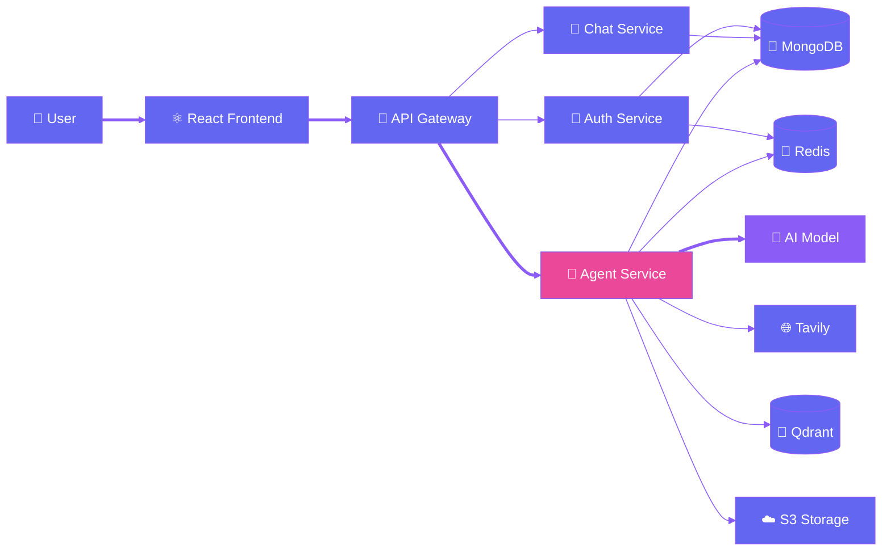
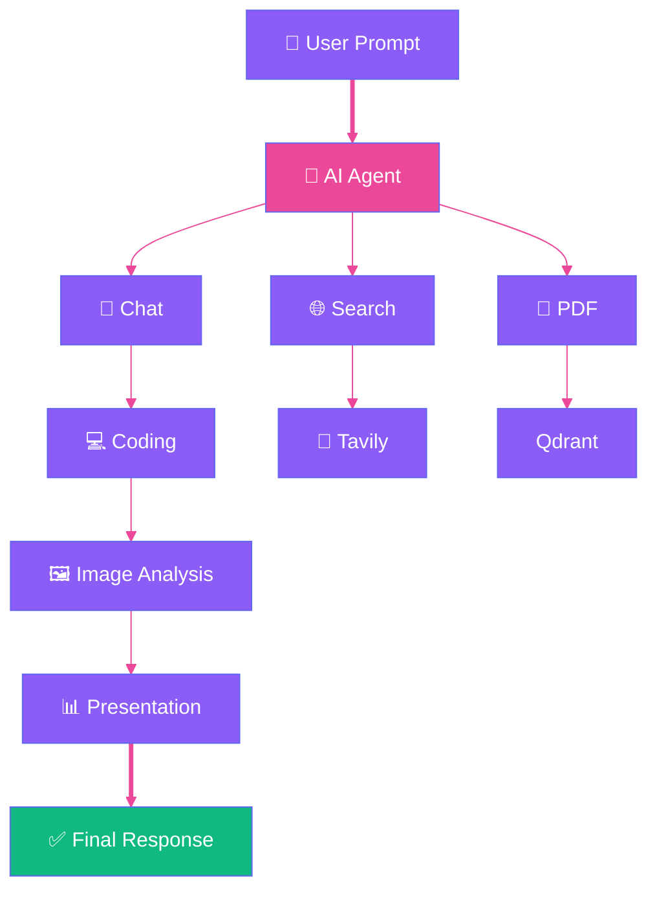
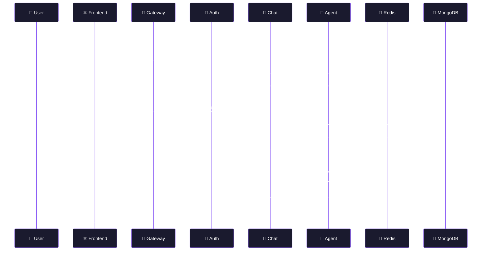
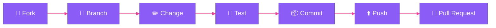

<div align="center">


<br/>

<p>
  
  
  
  
  
  
</p>

<p>
  
  
  
  
</p>

<a href="#-quick-start"></a>
<a href="#-features"></a>
<a href="#-api-documentation"></a>

</div>

<br/>


## ✨ Overview

**AI Assistant** is a full-stack, authenticated conversational AI platform built on a modular microservices architecture — one interface, many superpowers.

<table align="center">
<tr>
  <td align="center" width="16%">💬<br/><b>Chat</b></td>
  <td align="center" width="16%">🌐<br/><b>Web Search</b></td>
  <td align="center" width="16%">💻<br/><b>Coding</b></td>
  <td align="center" width="16%">📄<br/><b>PDF Retrieval</b></td>
  <td align="center" width="16%">🖼️<br/><b>Vision</b></td>
  <td align="center" width="16%">📊<br/><b>Slides</b></td>
</tr>
</table>

The system cleanly separates **authentication**, **conversations**, **AI-agent execution**, and **API routing** into independent backend services — each one scalable and swappable on its own.

<br/>

## 🎬 Application Flow



<details>
<summary><b>🏗️ Click to expand — Full System Architecture</b></summary>

```text
                         ┌──────────────────────┐
                         │      👤 User         │
                         └──────────┬───────────┘
                                    │
                                    ▼
                         ┌──────────────────────┐
                         │  ⚛️ React + Vite     │
                         │      Frontend        │
                         └──────────┬───────────┘
                                    │
                                    ▼
                         ┌──────────────────────┐
                         │    🚪 API Gateway    │
                         │        :4000         │
                         └───────┬──────┬───────┘
                                 │      │
                   ┌─────────────┘      └─────────────┐
                   ▼                                   ▼
          ┌────────────────┐                  ┌────────────────┐
          │ 🔐 Auth        │                  │ 💬 Chat        │
          │ Service :4001  │                  │ Service :4002  │
          └───────┬────────┘                  └───────┬────────┘
                  │                                    │
                  └──────────────┬─────────────────────┘
                                 │
                                 ▼
                       ┌────────────────────┐
                       │ 🤖 Agent Service   │
                       │    LangGraph       │
                       │      :4003         │
                       └─────────┬──────────┘
                                 │
          ┌──────────────────────┼──────────────────────┐
          │                      │                      │
          ▼                      ▼                      ▼
     🧠 AI Models          🌐 Web Search          📄 Documents
   OpenAI / Gemini /          Tavily              Qdrant
   Groq / Mistral /
   OpenRouter / etc.
          │                      │                      │
          └──────────────────────┼──────────────────────┘
                                 ▼
                         ☁️ Object Storage
```

</details>

<br/>

## 📂 Project Structure

```text
AI-Assistant/
│
├── Frontend/                     # ⚛️ React 19 + Vite
│
└── Backend/
    │
    ├── gateway/                 # 🚪 Public API Gateway
    │
    ├── services/
    │   ├── auth/                # 🔐 Authentication & Users
    │   ├── chat/                # 💬 Conversations & Messages
    │   └── Agent/                # 🤖 LangGraph AI Agent
    │
    └── shared/
        └──                      # 🔧 Shared auth & Redis utilities
```

<br/>

## 🚀 Features

<table>
<tr>
<td width="50%" valign="top">

### 💬 AI Chat
- Real-time conversational interaction
- Persistent conversations & history
- Multiple AI model providers
- Context-aware agent execution

</td>
<td width="50%" valign="top">

### 🌐 Web Search
- AI-powered web search
- Tavily integration
- Search-aware, grounded responses
- External information retrieval

</td>
</tr>
<tr>
<td width="50%" valign="top">

### 📄 PDF Intelligence
- PDF upload & processing
- Vector embeddings
- Semantic retrieval
- Qdrant integration

</td>
<td width="50%" valign="top">

### 🖼️ Image Analysis
- Image uploads
- Vision-capable model integration
- Rich image understanding
- AI-generated analysis

</td>
</tr>
<tr>
<td width="50%" valign="top">

### 💻 Coding Assistant
- Code generation
- Debugging assistance
- Code explanation
- Technical problem solving

</td>
<td width="50%" valign="top">

### 📊 Presentation Generation
- AI-generated presentations
- Structured content generation
- Artifact creation
- S3-compatible storage support

</td>
</tr>
</table>

<br/>

## 🧠 AI Agent

Built on **LangGraph**, the agent is the central intelligence layer — dynamically routing each request to the right capability instead of treating every prompt as a plain chat completion.



<br/>

## 🛠️ Tech Stack

<div align="center">

**Frontend**


**Backend**


**AI & Integrations**


</div>

<br/>


## ⚙️ Quick Start

### 1️⃣ Prerequisites

| Requirement | Notes |
|---|---|
| Node.js 20+ | Required |
| npm | Required |
| MongoDB | Required |
| Redis | Required |
| Firebase Admin credentials | Required |
| One AI provider API key | Required |
| Tavily API key | Optional |
| Qdrant | Optional |
| S3-compatible storage | Optional |

### 2️⃣ Clone & Install

```powershell
git clone <your-repository-url>
cd AI-Assistant
```

<details>
<summary><b>📦 Install every service (click to expand)</b></summary>

```powershell
# Frontend
cd Frontend
npm install

# Gateway
cd ..\Backend\gateway
npm install

# Auth Service
cd ..\services\auth
npm install

# Chat Service
cd ..\chat
npm install

# Agent Service
cd ..\Agent
npm install
```

</details>

<br/>

## 🔐 Environment Variables

> ⚠️ **Never commit `.env` files or Firebase service-account credentials.**

Create a `.env` file inside each backend service.

<details>
<summary><b>🚪 Gateway — <code>Backend/gateway/.env</code></b></summary>

```env
PORT=4000
FRONTEND_URL=http://localhost:5173
AUTH=http://localhost:4001
CHAT=http://localhost:4002
AGENT=http://localhost:4003
```

</details>

<details>
<summary><b>🔐 Auth Service — <code>Backend/services/auth/.env</code></b></summary>

```env
PORT=4001
db=mongodb://127.0.0.1:27017/ai-assistant
REDIS_URL=redis://127.0.0.1:6379
```

Firebase Admin credentials live at:
`Backend/services/auth/config/services.json` — **never commit the real file.**

</details>

<details>
<summary><b>💬 Chat Service — <code>Backend/services/chat/.env</code></b></summary>

```env
PORT=4002
db=mongodb://127.0.0.1:27017/ai-assistant
```

</details>

<details>
<summary><b>🤖 Agent Service — <code>Backend/services/Agent/.env</code></b></summary>

```env
PORT=4003
db=mongodb://127.0.0.1:27017/ai-assistant
REDIS_URL=redis://127.0.0.1:6379
CHAT_SERVICE=http://localhost:4002

# AI Model Providers
OPENAI_API_KEY=
GOOGLE_API_KEY=
GROQ_API_KEY=
MISTRAL_API_KEY=
OPENROUTER_API_KEY=
MOONSHOT_API_KEY=

# Optional integrations
TAVILY_API_KEY=
QDRANT_URL=
QDRANT_API_KEY=
AWS_REGIONS=
AWS_BUCKET=
accessKeyId=
secretAccessKey=
accountId=
```

Configure the active provider in:
`Backend/services/Agent/utils/model.js`

</details>

<details>
<summary><b>⚛️ Frontend — <code>Frontend/.env</code></b></summary>

```env
VITE_BACKEND_URI=http://localhost:4000/api
```

> 🔒 Never put secret keys in `VITE_*` variables — Vite exposes these to the browser bundle.

</details>

<br/>

## 🔴 Redis Setup

```powershell
cd Backend
docker compose up -d redis   # start
docker ps                    # verify
docker compose down          # stop
```

<br/>

## ▶️ Running the Application

Run each service in its own terminal:

| Terminal | Service | Command |
|---|---|---|
| 1 | 🔐 Auth | `cd Backend\services\auth && npm run dev` |
| 2 | 💬 Chat | `cd Backend\services\chat && npm run dev` |
| 3 | 🤖 Agent | `cd Backend\services\Agent && npm run dev` |
| 4 | 🚪 Gateway | `cd Backend\gateway && npm run dev` |
| 5 | ⚛️ Frontend | `cd Frontend && npm run dev` |

<br/>

## 🌍 Local URLs

| Service | URL |
|---|---|
| ⚛️ Frontend | `http://localhost:5173` |
| 🚪 Gateway | `http://localhost:4000` |
| 🔐 Auth | `http://localhost:4001` |
| 💬 Chat | `http://localhost:4002` |
| 🤖 Agent | `http://localhost:4003` |

Gateway health check → `http://localhost:4000/`

<br/>


## 🔌 API Documentation

All public requests go through the gateway under the `/api` prefix.

| Route | Method | Description |
|---|---:|---|
| `/api/auth/login` | `POST` | Create/authenticate user |
| `/api/auth/logout` | `GET` | Logout current user |
| `/api/auth/me` | `GET` | Get authenticated user |
| `/api/chat/create-conversation` | `GET` | Create conversation |
| `/api/chat/get-conversation` | `GET` | List conversations |
| `/api/chat/save` | `POST` | Save message |
| `/api/chat/update` | `PUT` | Update conversation |
| `/api/chat/message` | `GET` | Retrieve messages |
| `/api/agent/chat` | `POST` | Execute AI agent |

**Agent File Upload** — multipart form-data with a `file` field:

```text
POST /api/agent/chat
Content-Type: multipart/form-data
```

<br/>

## 🔄 Request Lifecycle



<br/>

## 🧩 Microservices

<table>
<tr><td width="25%" align="center">🔐<br/><b>Auth</b></td><td>User authentication · user management · session handling · Firebase Admin integration · Redis-backed auth data</td></tr>
<tr><td align="center">💬<br/><b>Chat</b></td><td>Creating conversations · retrieving conversations · saving messages · updating conversations · message history</td></tr>
<tr><td align="center">🤖<br/><b>Agent</b></td><td>AI model interaction · LangGraph orchestration · web search · PDF processing · image analysis · coding assistance · presentation generation · agent memory</td></tr>
<tr><td align="center">🚪<br/><b>Gateway</b></td><td>Public API entry point · request routing · service communication · frontend-to-backend bridge</td></tr>
</table>

<br/>

## 🏭 Production Build

```powershell
# Frontend
cd Frontend
npm run build
npm run preview

# Backend (run inside each service + gateway)
npm start
```

<br/>

## 🧪 Testing & Quality

> Backend automated tests are not yet configured. Frontend provides ESLint.

```powershell
cd Frontend
npm run lint
npm run build
```

<br/>

## 🔒 Security Checklist

- ❌ Never commit `.env` files
- ❌ Never commit Firebase service-account credentials
- ❌ Never expose provider API keys through `VITE_*`
- ✅ Store secrets only on the backend
- ✅ Configure the exact production frontend origin
- ✅ Use HTTPS
- ✅ Use secure cookie settings
- ✅ Restrict database and Redis network access
- ✅ Rotate leaked credentials immediately

```gitignore
.env
.env.*
!.env.example
Backend/services/auth/config/services.json
```

<br/>

## 🌟 Roadmap

- [ ] Streaming AI responses
- [ ] Token usage tracking
- [ ] Conversation sharing
- [ ] Rate limiting
- [ ] Background agent jobs
- [ ] Better observability and logging
- [ ] Automated backend tests
- [ ] Dockerized production deployment
- [ ] CI/CD pipeline
- [ ] Role-based access control
- [ ] Agent execution tracing
- [ ] Multi-user collaboration

<br/>

## 📸 Screenshots

```text
docs/
├── dashboard.png
├── chat.png
├── pdf-analysis.png
├── image-analysis.png
└── presentation.png
```

```markdown

```

<br/>

## 🤝 Contributing

<div align="center">



</div>

<br/>

## 📄 License

Add your preferred license here.

<br/>

<div align="center">


**AI Assistant — One platform. Multiple AI capabilities.**

</div>